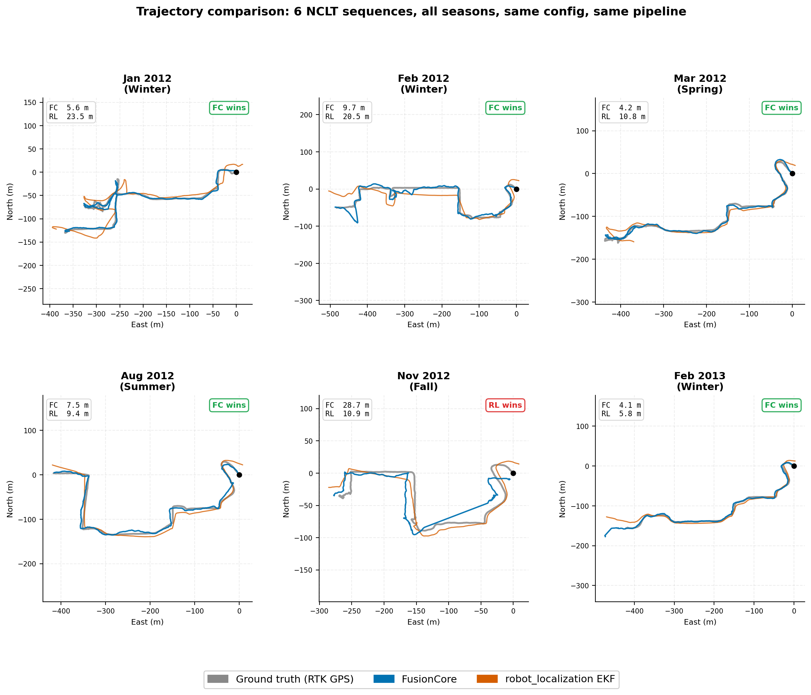

# FusionCore

[](https://github.com/manankharwar/fusioncore/actions/workflows/ci.yml)
[](https://doi.org/10.5281/zenodo.19834991)
[](https://manankharwar.github.io/fusioncore/)
[](paper/fusioncore_arxiv.pdf)

**ROS 2 sensor fusion: IMU + wheel encoders + GPS fused via UKF at 100 Hz. 22-state filter with IMU bias estimation, adaptive noise covariance, and chi-squared outlier rejection on every sensor.**

<p align="center">
  
</p>
---

## Why I built this

I needed sensor fusion for a mobile robot project and reached for `robot_localization` like everyone does. It works well. But I wanted a filter that estimated IMU gyro and accelerometer bias as part of the state vector, adapted its noise covariance from real sensor behavior rather than config values, and rejected outliers on every sensor update: not just GPS.

So I built FusionCore. It's a 22-state UKF that fuses IMU, wheel encoders, and GPS natively. Gyro and accelerometer bias are estimated continuously as filter states. Noise covariance adapts from the innovation sequence automatically. Every sensor update: IMU, wheel odometry, GPS: goes through a chi-squared gate before it touches the filter. GPS is handled in ECEF directly, no coordinate projection.

<p align="center">
  
</p>

---

## Benchmark

FusionCore vs robot_localization on the [NCLT dataset](http://robots.engin.umich.edu/nclt/): same IMU + wheel odometry + GPS, no manual tuning. Six sequences:

RL-EKF run with `odom0_twist_rejection_threshold: 4.03` and `odom1_pose_rejection_threshold: 3.72` (chi²-equivalent to FusionCore's thresholds at 99.9% confidence).

| Sequence | FC ATE RMSE | RL-EKF ATE RMSE | RL-UKF |
|---|---|---|---|
| 2012-01-08 | **5.6 m** | 13.0 m | NaN divergence at t=31 s |
| 2012-02-04 | **9.7 m** | 19.1 m | NaN divergence at t=22 s |
| 2012-03-31 | **4.2 m** | 54.3 m | NaN divergence at t=18 s |
| 2012-08-20 | **7.5 m** | 24.1 m | NaN divergence |
| 2012-11-04 | 28.6 m | **9.6 m** | NaN divergence |
| 2013-02-23 | **4.1 m** | 11.0 m | NaN divergence |

---

## Install

Supports **ROS 2 Jazzy** (Ubuntu 24.04) and **Humble** (Ubuntu 22.04).

```bash
mkdir -p ~/ros2_ws/src && cd ~/ros2_ws/src
git clone https://github.com/manankharwar/fusioncore.git
cd ~/ros2_ws
source /opt/ros/jazzy/setup.bash  # or /opt/ros/humble/setup.bash
rosdep install --from-paths src --ignore-src -r -y
colcon build && source install/setup.bash
```

> **Headless / Raspberry Pi:** `touch ~/ros2_ws/src/fusioncore/fusioncore_gazebo/COLCON_IGNORE` before building to skip the Gazebo package.

---

## Quick start

```bash
ros2 launch fusioncore_ros fusioncore_nav2.launch.py \
  fusioncore_config:=/path/to/your_robot.yaml
```

---

## Documentation

**[manankharwar.github.io/fusioncore](https://manankharwar.github.io/fusioncore/)**

- [Getting Started](https://manankharwar.github.io/fusioncore/getting-started/)
- [Configuration reference](https://manankharwar.github.io/fusioncore/configuration/)
- [Hardware configs](https://manankharwar.github.io/fusioncore/hardware/)
- [Nav2 integration](https://manankharwar.github.io/fusioncore/nav2/)
- [Migrating from robot_localization](https://manankharwar.github.io/fusioncore/migration_from_robot_localization/)
- [How it works](https://manankharwar.github.io/fusioncore/how-it-works/)

---

## License

Apache 2.0.

---

## Citation

```bibtex
@software{kharwar2026fusioncore,
  author    = {Kharwar, Manan},
  title     = {FusionCore: ROS 2 UKF Sensor Fusion},
  year      = {2026},
  publisher = {Zenodo},
  version   = {0.2.0},
  doi       = {10.5281/zenodo.19834991},
  url       = {https://doi.org/10.5281/zenodo.19834991}
}
```

---

Issues answered within 24 hours. Open a GitHub issue or find the discussion on [ROS Discourse](https://discourse.ros.org).
