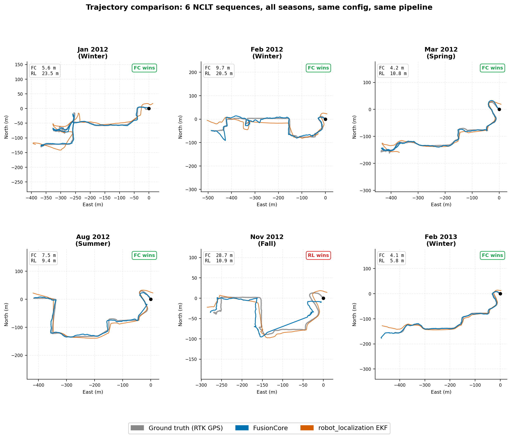

# FusionCore

[](https://github.com/manankharwar/fusioncore/actions/workflows/ci.yml)
[](https://arxiv.org/abs/2605.25239)
[](https://doi.org/10.5281/zenodo.20091053)
[](https://manankharwar.github.io/fusioncore/)
[](https://manankharwar.substack.com)

**A 23-state UKF for outdoor robots: IMU, wheel encoders, GPS and visual SLAM at 100 Hz. It fuses the sensors you already have, and when the estimate goes wrong it tells you which sensor and why instead of drifting silently. Apache 2.0, ROS 2 Jazzy and Humble, and the filter itself is a plain C++ library with no ROS dependency.**


---

## Quick start

```bash
sudo apt install ros-jazzy-fusioncore     # or ros-humble-fusioncore
```

Or from source:

```bash
mkdir -p ~/ros2_ws/src && cd ~/ros2_ws/src
git clone https://github.com/manankharwar/fusioncore.git
cd ~/ros2_ws
rosdep install --from-paths src --ignore-src -r -y
colcon build --packages-up-to fusioncore_ros
source install/setup.bash
```

Check it works before wiring it to a robot. This starts the filter with fake sensors and verifies every output, in about 15 seconds:

```bash
bash tools/quick_test.sh
```

Then point it at your robot:

```bash
ros2 launch fusioncore_ros fusioncore.launch.py \
  fusioncore_config:=/path/to/your_robot.yaml
```

The launch file brings the lifecycle node all the way up to `active` on its own. Pass `autoconfigure:=false` if a `nav2_lifecycle_manager` should own it instead.

Docker, if you would rather not install ROS 2: [docs/docker.md](https://manankharwar.github.io/fusioncore/docker/)

```bash
docker run --rm ghcr.io/manankharwar/fusioncore:latest bash tools/quick_test.sh
```

---

## When it goes wrong, it tells you why

Most localization debugging is not a mathematics problem. The filter drifts, and the hard part is working out which of six sensors caused it. FusionCore publishes what it is thinking while it runs, on real hardware:

```bash
ros2 topic echo /fusion/debug/gnss_status     # one message per GPS fix
ros2 topic echo /fusion/debug/filter_health   # filter state at 1 Hz
```

`gnss_status` answers "why was that fix dropped?" for every fix. A `rejection_reason` (`CHI2_FAILED`, `SIGMA_XY_HIGH`, `IMPLAUSIBLE_JUMP`, `DELAY_TOO_LARGE` and the rest), the Mahalanobis distance printed next to the threshold it was actually tested against, and the filter's own position sigma at that moment.

`filter_health` answers "does this filter even know which way it is pointing?" Per-sensor innovation norms, heading uncertainty in degrees, which source the heading came from (`GPS_TRACK`, `MAGNETOMETER`, `DUAL_ANTENNA`, `NONE`), and a separate count of measurements dropped because two drivers disagree about the clock rather than because the data was bad.

That last distinction matters more than it sounds. A sensor whose timestamps run behind the filter clock is not being fused at all, and from the outside that looks exactly like a badly tuned filter.

You can also ask, after the fact, whether the covariance the filter reported was honest. This needs no ground truth and works on any recorded bag:

```bash
python3 tools/nis_from_bag.py /path/to/your_bag
```

Details: [Is your filter's covariance honest?](https://manankharwar.github.io/fusioncore/guides/filter-consistency/)

---

## What FusionCore does not do

Every project has these. Most do not write them down.

**Yaw is not observable from a 6-axis IMU, wheel encoders and GPS position alone.** The gyro measures `wz + gyro_bias` and the encoder measures `wz + encoder_bias`, which is two equations for three unknowns. GPS track heading only helps while the robot moves in a straight line fast enough for the displacement bearing to beat the position noise. Add a magnetometer or dual-antenna GNSS heading and the problem goes away. Without one, expect heading uncertainty to grow during slow or twisty driving, and read `heading_sigma_deg` in `filter_health` rather than assuming.

**The chi-squared gate is less sensitive than its nominal threshold on a smoothing receiver.** Many GNSS receivers report their absolute accuracy, several metres dominated by multipath, while emitting fixes that agree with each other to centimetres because they filter internally. A Kalman filter assumes white measurement noise, so it gets handed a covariance far larger than any innovation it will see, and the gate then sits much further above typical than its 99.9% design point suggests. Measure yours with `nis_from_bag.py` before relying on the gate.

**Long GPS blackouts still accumulate heading error.** Beyond roughly five to seven minutes of dead reckoning, residual bias drift dominates. See [known limitations](https://manankharwar.github.io/fusioncore/known-limitations/).

---

## Built around the problems real robots have

| The problem | How FusionCore handles it |
|---|---|
| **IMU calibration is approximate** | Gyro and accel bias are filter states, estimated continuously. `init.stationary_window: 2.0` estimates startup bias before motion begins. |
| **Extrinsic calibration is never exact** | Reads `frame_id` from every IMU message and looks up the TF rotation to `base_link` automatically. Set `imu.frame_id` to override broken frame names from drivers. No manual rotation matrices. |
| **Sensors disagree about what time it is** | Stamps more than 1 s from the node clock warn at startup. A sensor lagging the filter clock is rejected as stale rather than being allowed to corrupt it, and the count is published so you can see it happening. |
| **GPS arrives late (50 to 200 ms)** | An IMU ring buffer replays 1 second of buffered updates when a delayed fix arrives, reconstructing the state at the GPS timestamp rather than approximating it. |
| **Wheel odometry is noisy or slipping** | Adaptive noise covariance updates from the innovation sequence. Optional GPS velocity fusion compares GPS speed against wheel speed every cycle, so the innovation reveals slip and the gain down-weights it. |
| **Noise parameters need days of tuning** | Two numbers from your IMU datasheet, `imu.gyro_noise` and `imu.accel_noise`. The adaptive estimators handle the rest, though a bad frame or a bad timestamp will still need fixing by hand. |
| **The robot runs on a Raspberry Pi** | Well under 1 ms per cycle on a Pi 4 in a Release build. Same source on ARM and x86 via Eigen. Build unoptimised and it is drastically slower, so do not skip `CMAKE_BUILD_TYPE` (0.3.8 and later default to Release). |
| **Two IMUs on the platform** | Set `imu2.topic` to fuse a second IMU as an independent measurement. No pre-merging needed. |
| **GPS drops out under canopy** | Inertial coast mode holds position through sustained dropout, and the gate relaxes on re-acquisition after a genuine gap rather than after a sustained outlier. |
| **The robot sits still for minutes** | ZUPT fuses a zero-velocity pseudo-measurement when encoder speed and angular rate are both below threshold, so IMU noise does not integrate into drift while idle. |


---

## Benchmark

FusionCore against robot_localization on the [NCLT dataset](http://robots.engin.umich.edu/nclt/): same IMU, wheel odometry and GPS, no manual tuning, twelve full-length sequences across all seasons. RL-EKF run with chi-squared-equivalent thresholds at 99.9% confidence.

**Read the caveat in the section above before quoting these.** They are a May 2026 snapshot and have not been re-verified end to end on current `main`. One is known to have moved: 2013-04-05 has regressed from 12.1 m to about 19.4 m, still a 93% win.

| Sequence | Season | Duration | FC ATE RMSE | RL-EKF ATE RMSE | Winner |
|---|---|---|---|---|---|
| 2012-01-08 | Winter | 92 min | **18.6 m** | 41.2 m | FC +55% |
| 2012-02-04 | Winter | 77 min | **49.7 m** | 265.5 m | FC +81% |
| 2012-03-31 | Spring | 87 min | **22.0 m** | 156.5 m | FC +86% |
| 2012-05-11 | Spring | 84 min | **9.7 m** | 11.5 m | FC +16% |
| 2012-06-15 | Summer | 55 min | 49.2 m | **18.2 m** | RL +63% |
| 2012-08-20 | Summer | 83 min | 98.3 m | **10.6 m** | RL +89% |
| 2012-09-28 | Fall | 77 min | **22.4 m** | 53.8 m | FC +58% |
| 2012-10-28 | Fall | 85 min | **15.6 m** | 56.4 m | FC +72% |
| 2012-11-04 | Fall | 79 min | **60.1 m** | 122.0 m | FC +51% |
| 2012-12-01 | Winter | 75 min | **21.0 m** | 90.7 m | FC +77% |
| 2013-02-23 | Winter | 78 min | **59.4 m** | 82.2 m | FC +28% |
| 2013-04-05 | Spring | 68 min | **12.1 m** | 268.9 m | FC +96% |


RL-UKF diverges with NaN on all twelve. Where RL-EKF loses, the cause is consistent: the GPS driver reports 3 m sigma, but measured against RTK ground truth the actual p95 noise is 9.7 to 53.1 m depending on the day. RL's gate is calibrated to the stated 3 m and rejects valid fixes on bad-GPS days, while `adaptive.gnss` keeps FusionCore's chi2 statistics calibrated at runtime.

**Both FusionCore losses are the same problem**, and it is the honest limit of the design: multi-minute GPS blackouts, where heading has no absolute reference and robot_localization's simpler 2D model drifts less. 2012-06-15 is a 462-second blackout. That is what an absolute heading source fixes, and it is why the magnetometer support exists.


Per-sequence analysis with root causes: [benchmarks/README.md](benchmarks/README.md)

<p align="center">
  
</p>

---

## Running on real hardware

> "The system was stable on real robot data and was relatively easy to configure. I was able to get reasonable behavior without spending excessive time on parameter tuning. The overall experience felt more deployment-oriented than research-demo-oriented."
>
> **Michał Bednarek** ([@mbed92](https://github.com/mbed92)), Robotics PhD
> Factory differential-drive robot, ROS 2 Humble: Cartographer (point-cloud localization, no preloaded map) + wheel odometry + IMU

> **Sam** ([@samuk](https://github.com/samuk)), [Agroecology Lab](https://github.com/Agroecology-Lab/feldfreund_devkit_ros)
> Outdoor agricultural robot, integration in progress

> **Russ Hall**, Andino robot (Raspberry Pi)
> OAK-D (stereo depth + IMU) + Velodyne VLP-16 + rtabmap: indoor SLAM mapping

Running FusionCore on your robot? Add yourself in [Discussions #22](https://github.com/manankharwar/fusioncore/discussions/22) and I will list you in [ADOPTERS.md](ADOPTERS.md).


---

## Coming from robot_localization

FusionCore replaces the robot_localization + navsat_transform pair with one lifecycle node. The migration guide covers the YAML and launch changes: [migration guide](https://manankharwar.github.io/fusioncore/migration_from_robot_localization/)


| Problem | How FusionCore handles it |
|---|---|
| A GPS outlier corrupts the state | Chi-squared gate per sensor DOF rejects bad fixes before they reach the filter, and reports which gate fired. Covariance is bounded at every step, so no NaN divergence. |
| UTM zone boundary near the operating area | GPS is fused directly in ECEF. No UTM projection and no zone boundary case. |
| A wheeled robot drifts sideways without GPS | Non-holonomic constraint zeros lateral and vertical velocity as a virtual measurement on every encoder update. |
| GPS fixes arrive 50 to 200 ms late | IMU ring buffer with retrodiction reconstructs the exact filter state at the GPS timestamp. |
| Bag replay gives different results each run | Message timestamps drive all updates under `use_sim_time: true`. Same bag, same config, same output. |
| An IMU mounted off-axis, or a driver with a wrong frame name | TF lookup on every message, with an `imu.frame_id` override. |
| navsat_transform startup ordering and CPU cost | No navsat_transform node. ECEF conversion is one matrix multiply per fix inside the filter. |


---

## Using the filter without ROS 2

`fusioncore_core` is a plain C++17 library. Its only dependency is Eigen, and it contains no ROS headers, so it compiles and runs on its own:

```cpp
#include "fusioncore/fusioncore.hpp"

fusioncore::FusionCoreConfig cfg;
fusioncore::FusionCore fc(cfg);
fusioncore::State s;
fc.init(s, 0.0);
fc.update_imu(0.01, wx, wy, wz, ax, ay, az);
fc.update_encoder(0.02, vx, 0.0, wz);

fusioncore::sensors::GnssFix fix;      // ENU metres, plus hdop/vdop/satellites
fix.x = 12.0; fix.y = 3.0; fix.z = 0.0;
fc.update_gnss(0.20, fix);

const auto& out = fc.get_state();      // out.x is the 23-state vector, out.P its covariance
```

```bash
g++ -std=c++17 -O2 your_main.cpp fusioncore_core/src/*.cpp \
    -I fusioncore_core/include -I /usr/include/eigen3 -o your_app
```

Useful if you are on PX4, a custom middleware, or an embedded loop where ROS 2 is not the right fit. `fusioncore_ros` is a thin wrapper over exactly this API.

---

## In the ecosystem

**rtabmap_ros (merged):** included as a named demo in the official [rtabmap_ros](https://github.com/introlab/rtabmap_ros) repository. The demo runs FusionCore and `icp_odometry` in a feedback loop: FusionCore's stable odom frame seeds scan matching via `guess_frame_id`, and the ICP result returns as a second velocity source. [View the demo](https://github.com/introlab/rtabmap_ros/tree/ros2/rtabmap_demos)

**Stereolabs community:** a FusionCore + ZED integration guide is posted on the Stereolabs developer forum. Under evaluation by [@privvyledge](https://github.com/privvyledge) against Wolf, TIER IV EagleEye and robot_localization on an F1/10 scale car and a full-size autonomous van.

**OpenMowerNext:** [PR #45](https://github.com/jkaflik/OpenMowerNext/pull/45) integrates FusionCore as the localization stack for a community ROS 2 mowing system, replacing robot_localization with a single lifecycle node fusing RTK GPS (u-blox F9P), IMU and wheel odometry.

---

## Documentation

**[manankharwar.github.io/fusioncore](https://manankharwar.github.io/fusioncore/)**

- [Getting Started](https://manankharwar.github.io/fusioncore/getting-started/)
- [Configuration reference](https://manankharwar.github.io/fusioncore/configuration/)
- [Hardware configs](https://manankharwar.github.io/fusioncore/hardware/)
- [Nav2 integration](https://manankharwar.github.io/fusioncore/nav2/)
- [Migrating from robot_localization](https://manankharwar.github.io/fusioncore/migration_from_robot_localization/)
- [Is your filter's covariance honest?](https://manankharwar.github.io/fusioncore/guides/filter-consistency/)
- [Known limitations](https://manankharwar.github.io/fusioncore/known-limitations/)
- [How it works](https://manankharwar.github.io/fusioncore/how-it-works/)
- [Troubleshooting](https://manankharwar.github.io/fusioncore/troubleshooting/)

---

## Contributing

Bug reports are genuinely useful here and several have changed the library. If
something misbehaves, the fastest route to an answer is usually the filter's own
diagnostics, which the [bug report template](.github/ISSUE_TEMPLATE/bug_report.md)
asks for:

```bash
ros2 topic echo /fusion/debug/filter_health --once
ros2 topic echo /fusion/debug/gnss_status --once
```

If you would rather write code, the
[good first issues](https://github.com/manankharwar/fusioncore/labels/good%20first%20issue)
are scoped so you do not need to understand the estimator to pick one up. They
point at the file and the line, and each one comes from a real failure rather than
a wishlist. [CONTRIBUTING.md](CONTRIBUTING.md) has the build and test steps.

---

## License

Apache 2.0, and it stays that way.

---

## Citation

```bibtex
@article{kharwar2026fusioncore,
  author  = {Kharwar, Manan},
  title   = {FusionCore: A 23-State Unscented Kalman Filter for
             IMU, Wheel Encoder, GPS, and Visual SLAM Fusion in ROS 2},
  journal = {arXiv preprint arXiv:2605.25239},
  year    = {2026},
  url     = {https://arxiv.org/abs/2605.25239}
}
```

To cite the software release itself:

```bibtex
@software{kharwar2026fusioncore_software,
  author    = {Kharwar, Manan},
  title     = {FusionCore: ROS 2 UKF Sensor Fusion},
  year      = {2026},
  publisher = {Zenodo},
  doi       = {10.5281/zenodo.20091053},
  url       = {https://doi.org/10.5281/zenodo.20091053}
}
```

---

Bug reports with a log and a config get answered, usually the same day. If something behaves strangely, `/fusion/debug/filter_health` and `tools/nis_from_bag.py` will often say why before I can.

Need it working on your hardware with someone accountable for the result? [Commercial support and fixed-price integration](https://manankharwar.github.io/fusioncore/support/).
