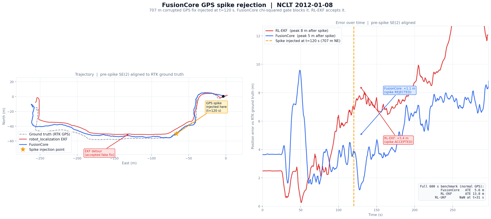

# FusionCore

**ROS 2 UKF sensor fusion for robots that run in the real world. IMU + wheel encoders + GPS at 100 Hz. Handles bad calibration, timestamp jitter, delayed GPS, wheel slip, and ARM hardware out of the box. Apache 2.0.**

[](https://github.com/manankharwar/fusioncore/actions/workflows/ci.yml)
[](https://arxiv.org/abs/2605.25239)
[](https://doi.org/10.5281/zenodo.20091053)

---

## Install

Supports **ROS 2 Jazzy** (Ubuntu 24.04) and **Humble** (Ubuntu 22.04).

```bash
mkdir -p ~/ros2_ws/src && cd ~/ros2_ws/src
git clone https://github.com/manankharwar/fusioncore.git
cd ~/ros2_ws
source /opt/ros/jazzy/setup.bash  # or /opt/ros/humble/setup.bash
rosdep install --from-paths src --ignore-src -r -y
colcon build && source install/setup.bash
```

!!! tip "Headless / Raspberry Pi"
    Add `COLCON_IGNORE` before building to skip the Gazebo package:
    ```bash
    touch ~/ros2_ws/src/fusioncore/fusioncore_gazebo/COLCON_IGNORE
    ```

```bash
ros2 launch fusioncore_ros fusioncore_nav2.launch.py \
  fusioncore_config:=/path/to/your_robot.yaml
```

---

## Works on the hardware you actually have

Most sensor fusion tutorials assume clean data. Real robots don't have clean data. FusionCore was built around the problems you actually run into.

| The problem | How FusionCore handles it |
|---|---|
| **IMU calibration is approximate** | Gyro and accel bias are filter states, estimated continuously. `init.stationary_window: 2.0` estimates startup bias before motion begins, dropping startup drift from ~10 cm to under 1 cm. |
| **Extrinsic calibration is never exact** | Reads `frame_id` from every IMU message and looks up the TF rotation to `base_link` automatically. Set `imu.frame_id` to override broken frame names from drivers (e.g. Gazebo TurtleBot3). No manual rotation matrices. |
| **Timestamp jitter and zero-stamped drivers** | `dt` is clamped to prevent divergence from missed timer ticks. Wall clock fallback for drivers that publish `stamp={sec=0}`. |
| **GPS arrives late (50–200 ms)** | IMU ring buffer replays 1 second of buffered updates when a delayed fix arrives. The state at the GPS timestamp is reconstructed exactly, not approximated. |
| **Wheel odometry is noisy or slipping** | Adaptive noise covariance updates from the innovation sequence. GPS velocity fusion (optional) compares GPS-reported speed against wheel speed every cycle: the innovation reveals slip and the Kalman gain down-weights the slipping wheel automatically. |
| **Noise parameters require days of tuning** | Two numbers from your IMU datasheet: `imu.gyro_noise` (ARW) and `imu.accel_noise` (VRW). Everything else adapts within the first minute of operation. |
| **Robot runs on Raspberry Pi or Jetson** | Under 0.2 ms per cycle on i7. Under 1 ms on Raspberry Pi 4. Same binary on ARM (NEON auto-detected) and x86 (AVX auto-detected) via Eigen. No recompilation, no parameter changes. |
| **Two IMUs on the platform** | Set `imu2.topic` to fuse a second IMU as an independent measurement. No pre-merging with `imu_filter_madgwick` needed. |
| **GPS drops out in tunnels or canopy** | Inertial coast mode maintains position integrity during sustained GPS dropout. Outlier gate relaxes automatically to reacquire when GPS returns. |
| **Robot sits still for minutes** | ZUPT (zero velocity update) fuses a zero-velocity pseudo-measurement when encoder speed and angular rate are both below threshold. Prevents IMU noise from integrating into position drift during idle periods. |
| **No GPS, no wheels: visual SLAM only** | Set `vslam.topic` to fuse 6-DOF pose from ORB-SLAM3, RTAB-Map, Kimera, or any VSLAM that publishes `nav_msgs/Odometry`. Mahalanobis gate rejects reinitializations and tracking jumps automatically. Runs on IMU + VSLAM alone, indoors, GPS-denied. |

---

## See it before you install

**No ROS, no robot, 30 seconds:**

```bash
git clone https://github.com/manankharwar/fusioncore && cd fusioncore
pip install numpy matplotlib
python3 tools/demo_quick.py --open
```

Shows GPS spike rejection and overall accuracy from pre-baked NCLT data included in the repo. A 707 m corrupted GPS fix is injected at t=120 s. FusionCore's chi-squared gate rejects it (position changes 1 m). RL-EKF accepts it and deviates 50+ m before recovering. RL-UKF diverges with NaN before the spike even fires.



---

## How FusionCore differs from robot_localization

robot_localization is a solid, well-maintained package used on tens of thousands of robots. FusionCore makes different architectural choices:

| Capability | robot_localization | FusionCore |
|---|---|---|
| GPS fusion | navsat_transform node required; ECEF TF frame added in rolling-devel | Filter state runs natively in ECEF: no UTM projection |
| IMU bias estimation | Not in state vector | Gyro + accel bias as filter states |
| Outlier rejection | Mahalanobis threshold (manual scalars, no DOF guidance) | Mahalanobis chi-squared gate (pre-calibrated to sensor DOF) |
| Adaptive noise estimation | Uses sensor-reported covariance as-is | Adapts from 50-sample innovation window |
| ZUPT | Not built-in | Auto when stationary |
| Delay compensation | `smooth_lagged_data` + `history_length` | IMU ring buffer replay |
| GPS fix quality gating | Not built-in | HDOP, satellite count, fix type |
| Dual antenna heading | Not built-in | Yes |
| Inertial coast mode | Not built-in | Auto on sustained GPS dropout |
| GPS velocity fusion (wheel slip detection) | Not built-in | Yes (Doppler vs wheel innovation reveals slip) |
| Radar Doppler velocity fusion | Not built-in | Yes (works indoors, all weather, slip detection) |
| VSLAM pose fusion | Not built-in | Yes: `vslam.topic` fuses 6-DOF pose from ORB-SLAM3, RTAB-Map, Kimera, etc. |
| Dual IMU | Not built-in | Yes: `imu2.topic` fuses a second IMU as an independent measurement |
| ROS 2 Jazzy / Humble | Ported from ROS 1 | Native, from scratch |

---


## Benchmark: 12 NCLT sequences, same config, no per-sequence tuning

Evaluated against robot_localization EKF on the [NCLT dataset](http://robots.engin.umich.edu/nclt/) (University of Michigan). Same IMU, wheel odometry, and GPS inputs. SE3-aligned ATE against RTK ground truth.

| Sequence | Season | Duration | FC ATE | RL-EKF ATE | Winner |
|---|---|---|---|---|---|
| 2012-01-08 | Winter | 92 min | **18.6 m** | 41.2 m | FC +55% |
| 2012-02-04 | Winter | 77 min | **49.7 m** | 265.5 m | FC +81% |
| 2012-03-31 | Spring | 87 min | **22.0 m** | 156.5 m | FC +86% |
| 2012-05-11 | Spring | 84 min | **9.7 m** | 11.5 m | FC +16% |
| 2012-06-15 | Summer | 55 min | 49.2 m | **18.2 m** | RL +63% |
| 2012-08-20 | Summer | 83 min | 98.3 m | **10.6 m** | RL +89% |
| 2012-09-28 | Fall | 77 min | **22.4 m** | 53.8 m | FC +58% |
| 2012-10-28 | Fall | 85 min | **15.6 m** | 56.4 m | FC +72% |
| 2012-11-04 | Fall | 79 min | **60.1 m** | 122.0 m | FC +51% |
| 2012-12-01 | Winter | 75 min | **21.0 m** | 90.7 m | FC +77% |
| 2013-02-23 | Winter | 78 min | **59.4 m** | 82.2 m | FC +28% |
| 2013-04-05 | Spring | 68 min | **12.1 m** | 268.9 m | FC +96% |

> **Note:** these numbers are a snapshot pending a controlled full-suite re-run on current `main`. The 10/12 result holds, but the 2013-04-05 figure (12.1 m) is stale: it has since regressed to ~19.4 m (still a 93% win). See `tools/benchmark_regression.md`.

**10/12 FC wins.** RL-EKF's losses trace to a single root cause: NCLT's GPS driver reports 3m sigma, but measured against RTK ground truth, actual p95 noise ranges from 9.7m to 53.1m depending on the day. RL's Mahalanobis gate is calibrated to the stated 3m, so it rejects valid fixes on sequences with higher actual noise. FusionCore's adaptive noise estimation (`adaptive.gnss: true`) adjusts the noise model in real time and keeps chi2 statistics calibrated.

The two FC losses (2012-06-15 and 2012-08-20) both have specific root causes: a 462-second GPS blackout causing heading drift, and an adversarial cluster of 105 corrupt GPS fixes at a blackout boundary. Full root-cause analysis and path-to-fix in the [benchmark reference](reference/benchmark.md).

RL-UKF diverged with NaN on all twelve sequences (known numerical instability under sim-time playback).

---


## Used on real hardware

Real engineers, real robots, real sensor data. Not demos.

> "The system was stable on real robot data and was relatively easy to configure. I was able to get reasonable behavior without spending excessive time on parameter tuning. The overall experience felt more deployment-oriented than research-demo-oriented."
>
> **Michał Bednarek** ([@mbed92](https://github.com/mbed92)), Robotics PhD
> Factory differential-drive robot, ROS 2 Humble: Cartographer (point-cloud localization, no preloaded map) + wheel odometry + IMU

<br>

> "Having a go at using FusionCore in an agricultural field robot. Hopefully will have a robot moving in a month or two."
>
> **Sam** ([@samuk](https://github.com/samuk)), [Agroecology Lab](https://github.com/Agroecology-Lab/feldfreund_devkit_ros)
> Outdoor agricultural robot, integration in progress

> **Russ Hall**, Andino robot (Raspberry Pi)
> OAK-D (stereo depth + IMU) + Velodyne VLP-16 + rtabmap: indoor SLAM mapping

Running FusionCore on your robot? Drop a note in [Discussions #22](https://github.com/manankharwar/fusioncore/discussions/22) and I will add you here.

---

## In the ecosystem

**rtabmap_ros (merged):** FusionCore is included as a named demo in the official [rtabmap_ros](https://github.com/introlab/rtabmap_ros) repository, maintained by @matlabbe. The demo ("Turtlebot3 Nav2, 2D LiDAR SLAM with FusionCore") shows FusionCore and icp_odometry running in a feedback loop: FusionCore's stable odom frame seeds scan matching via `guess_frame_id`, and the ICP result feeds back into FusionCore as a second velocity source. [View the demo](https://github.com/introlab/rtabmap_ros/tree/ros2/rtabmap_demos)

**Stereolabs community:** FusionCore + ZED integration guide posted on the Stereolabs developer forum, acknowledged by Stereolabs support. Under active evaluation by [@privvyledge](https://github.com/privvyledge) comparing FusionCore against Wolf, TIER IV EagleEye, and robot_localization on two platforms: an F1/10 scale car (indoor, VESC + RealSense D435i) and a full-size autonomous van (GPS + ZED 2i + 360 LiDAR).

---

## Where to go next

- **New user** → [Getting Started](getting-started.md)
- **Configuring your robot** → [Configuration](configuration.md)
- **Pick a config for your hardware** → [Hardware Configs](hardware/index.md)
- **Using with Nav2** → [Nav2 Integration](nav2.md)
- **FusionCore vs robot_localization** → [Technical Comparison](vs-robot-localization.md)
- **Coming from robot_localization** → [Migration Guide](migration_from_robot_localization.md)
- **Simulation / testing without hardware** → [Simulation](simulation.md)
- **How the filter actually works** → [How It Works](how-it-works.md)

---

## Running FusionCore on real hardware?

If localization is blocking your robot and you want help getting it working, open a [GitHub Discussion](https://github.com/manankharwar/fusioncore/discussions/22) or email [manan.kharwar@outlook.com](mailto:manan.kharwar@outlook.com) directly. Fixed scope, fixed price, guaranteed result.
