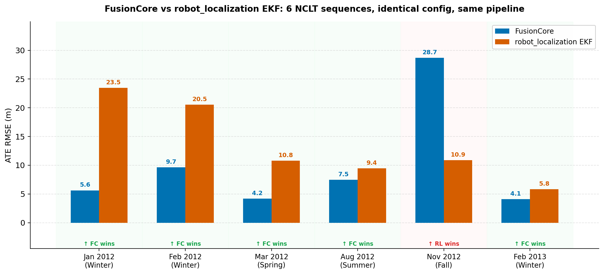

# Benchmark Results

FusionCore vs robot_localization on the [NCLT dataset](http://robots.engin.umich.edu/nclt/) (University of Michigan). Same IMU + wheel odometry + GPS inputs, no manual tuning. Six sequences, same pipeline.

  

| Sequence | FC ATE RMSE | RL-EKF ATE RMSE | RL-UKF |
|---|---|---|---|
| 2012-01-08 | **5.6 m** | 13.0 m | NaN divergence at t=31 s |
| 2012-02-04 | **9.7 m** | 19.1 m | NaN divergence at t=22 s |
| 2012-03-31 | **4.2 m** | 54.3 m | NaN divergence at t=18 s |
| 2012-08-20 | **7.5 m** | 24.1 m | NaN divergence |
| 2012-11-04 | 28.6 m | **9.6 m** | NaN divergence |
| 2013-02-23 | **4.1 m** | 11.0 m | NaN divergence |

FusionCore wins 5 of 6 sequences. RL-UKF diverged with NaN on all six (confirmed by the RL maintainer as a known numerical instability).

**RL-EKF gating config:** `odom0_twist_rejection_threshold: 4.03` (chi²(3, 0.999) = 16.27, sqrt = 4.03) and `odom1_pose_rejection_threshold: 3.72` (chi²(2, 0.999) = 13.82, sqrt = 3.72): matching FusionCore's per-sensor chi-squared thresholds at the same confidence level. Previous results used a non-existent parameter name (`odom0_mahal_threshold`) that RL silently ignored, leaving RL with no gating at all.

**On 2012-11-04** (fall, degraded GPS): FC's chi-squared gate traps itself: sustained GPS degradation causes continuous rejection → state drift → further rejection. RL-EKF re-anchors when signal improves. This is a genuine limitation of FC's outlier rejection under prolonged degraded conditions.

**Why gating hurts RL on most sequences:** RL takes GPS measurement covariance directly from the NavSatFix message (via navsat\_transform). NCLT's GPS receiver reports covariances that are tighter than actual noise, so innovations that are physically valid look like outliers at chi²(2, 0.999): and get rejected. FusionCore uses a user-specified noise floor (`gnss.base_noise_xy`) which is tuned to match real sensor behavior, giving better-calibrated innovation statistics under the same threshold.

  

---

## Reproduce

Full methodology, configs, and reproduce instructions in [`benchmarks/`](https://github.com/manankharwar/fusioncore/tree/main/benchmarks).
